# Environment Configuration Guide

## Overview

This document provides a comprehensive guide to the development and production environment configurations for the StackTracker application. Understanding these configurations is crucial for maintaining deployment stability and preventing configuration-related issues.

## Environment Architecture

```mermaid
graph TD
    A[Changes Review] --> B[Package.json Changes]
    A --> C[Script Changes]  
    A --> D[Component Changes]
    A --> E[Production Impact Analysis]
    
    B --> B1["dev:server script changed"]
    B1 --> B2["Added NODE_ENV=development"]
    B1 --> B3["Still uses server/startup.ts"]
    
    C --> C1["scripts/dev-local.sh"]
    C1 --> C2["Only cosmetic changes"]
    C1 --> C3["Still exports NODE_ENV=development"]
    
    D --> D1["BiomarkerHistoryChart.tsx"]
    D --> D2["BiomarkerFilter.tsx"]  
    D --> D3["labs.tsx"]
    D --> D4["use-lab-chart-data.ts"]
    D1 --> D5["Better validation & error handling"]
    D2 --> D5
    D3 --> D5
    D4 --> D5
    
    E --> F[Build Script]
    F --> F1["Unchanged: vite build && esbuild server/startup.ts"]
    
    E --> G[Start Script]
    G --> G1["Unchanged: NODE_ENV=production node dist/server/startup.js"]
    
    E --> H[Production Server]
    H --> H1["Still uses server/index.ts via startup.ts"]
    H --> H2["No changes to server/index.ts"]
    
    E --> I[Deployment Safety]
    I --> I1["✅ Build process unchanged"]
    I --> I2["✅ Production start unchanged"]
    I --> I3["✅ No server/index.ts modifications"]
    I --> I4["✅ Only dev scripts modified"]
    
    style I1 fill:#90EE90
    style I2 fill:#90EE90
    style I3 fill:#90EE90
    style I4 fill:#90EE90
```



## Development Environment

### Local Development Setup

1. **Primary Development Command**: `npm run dev:local`
   - Runs the script at `scripts/dev-local.sh`
   - Sets `NODE_ENV=development` explicitly
   - Starts both Express server and Vite dev server concurrently

2. **Alternative Development Command**: `npm run dev`
   - Runs both server and client in development mode
   - Server: `NODE_ENV=development tsx watch server/startup.ts`
   - Client: `vite`

### Development Server Configuration

- **Frontend URL**: http://localhost:5173 (Vite dev server)
- **API Server URL**: http://localhost:3001 (Express server)
- **Important**: Always access the application through the Vite server at port 5173

### Key Development Files

```
server/
├── startup.ts          # Entry point for both dev and prod
├── index.ts           # Main server configuration
├── auth/
│   ├── setup.ts       # Production auth setup
│   └── setup-simple.ts # Simplified auth for development
└── vite.ts            # Vite integration for development
```

### Development Features

- Hot module replacement via Vite
- Simplified authentication flow
- CORS enabled for localhost origins
- Detailed error logging and stack traces
- Session storage in memory (not file-based)

## Production Environment

### Production Build Process

```bash
npm run build
```

This executes:
```bash
vite build && esbuild server/startup.ts --bundle --platform=node --format=esm --outdir=dist/server --packages=external --external:vite --external:@vitejs/* --external:../vite.config*
```

### Production Start Process

```bash
npm start
```

This executes:
```bash
NODE_ENV=production node dist/server/startup.js
```

### Production Server Configuration

- **Port**: 8080 (AWS App Runner standard)
- **Host**: 0.0.0.0 (required for containerized environments)
- **Entry Flow**: `startup.js` → `index.js`
- **Static Files**: Served from `dist/client` directory

### Production Features

- AWS Secrets Manager integration for sensitive credentials
- Production-grade session management
- Rate limiting and DDoS protection
- Optimized static file serving
- Health check endpoints for AWS App Runner

## Critical Configuration Files

### 1. Package.json Scripts

```json
{
  "scripts": {
    "dev": "concurrently \"npm run dev:server\" \"npm run dev:client\"",
    "dev:server": "NODE_ENV=development tsx watch server/startup.ts",
    "dev:client": "vite",
    "dev:local": "./scripts/dev-local.sh",
    "build": "vite build && esbuild server/startup.ts --bundle --platform=node --format=esm --outdir=dist/server --packages=external --external:vite --external:@vitejs/* --external:../vite.config*",
    "start": "NODE_ENV=production node dist/server/startup.js"
  }
}
```

### 2. Vite Configuration (vite.config.ts)

Key settings for development:
```typescript
server: {
  host: '0.0.0.0',
  port: 5173,
  proxy: {
    '/api': {
      target: 'http://localhost:3001',
      changeOrigin: true,
    },
    '/auth': {
      target: 'http://localhost:3001',
      changeOrigin: true,
    }
  }
}
```

### 3. Environment Variables

**Development** (.env or .env.local):
```bash
NODE_ENV=development
PORT=3001
SESSION_SECRET=dev-secret-change-this
# Other development-specific variables
```

**Production** (AWS Secrets Manager):
- All sensitive credentials stored in AWS Secrets Manager
- Loaded dynamically at runtime
- Fallback to environment variables if Secrets Manager fails

## AWS App Runner Deployment

### Health Check Configuration

- **Path**: `/health`
- **Expected Response**: 200 OK with JSON body
- **Frequency**: Every 30 seconds
- **Timeout**: 5 seconds

### Important Deployment Notes

1. **Do NOT modify** `server/index.ts` without thorough testing
2. **Do NOT change** the build or start scripts without updating deployment configs
3. **Always test** in local development before deploying
4. **Ensure** health check endpoints remain accessible

## Common Issues and Solutions

### Issue: Local development proxy errors

**Solution**: Ensure the API server is running on port 3001 and access the app via http://localhost:5173

### Issue: Authentication not working locally

**Solution**: Check that `NODE_ENV=development` is set and `scripts/dev-local.sh` is being used

### Issue: Production deployment fails health checks

**Solution**: Verify that the `/health` endpoint is accessible and returns proper JSON response

## Best Practices

1. **Development Changes**: Test all changes locally using `npm run dev:local`
2. **Component Updates**: Ensure proper error handling and validation
3. **Server Updates**: Be extremely cautious with changes to `server/index.ts` or `server/startup.ts`
4. **Environment Variables**: Never commit sensitive credentials to the repository
5. **Deployment**: Always verify health checks pass before considering deployment successful

## Maintenance Guidelines

1. **Regular Updates**: Keep dependencies updated but test thoroughly
2. **Configuration Changes**: Document any changes to this guide
3. **Troubleshooting**: Check logs in AWS CloudWatch for production issues
4. **Local Testing**: Always use the dev-local script for consistent behavior

## Contact and Support

For deployment issues or configuration questions:
- Check AWS App Runner logs first
- Review this documentation
- Test in local development environment
- Document any new findings or solutions

---

*Last Updated: [Current Date]*
*Version: 1.0.0* 